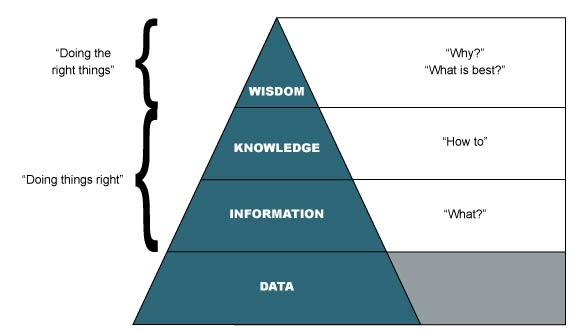

# cs215 Final Project: Personal Data Manifesto & Data Cookbook
Cookbook contained within cookbook.ipynb.
Make sure to run the server as instructed in the cookbook so it functions correctly.

## Data Manifesto

### What is data?
Data is the most basic form of useful information, the closest medium to objective reality, the foundation from which information and knowledge is derived. It is thorough enough to ensure clarity, but usually too large to make direct use of. This rawness is what makes data an invaluable asset in various fields, from business to science, as it serves as a neutral, fact-based starting point, free from the biases and interpretations that can alter information and knowledge.

In its purest form, data is akin to unpolished gem, holding immense potential but requiring skillful manipulation to reveal its true value. Just as a gemstone cutter shapes and polishes a rough stone to reveal its brilliance, data scientists and analysts must apply their expertise in processing and analyzing raw data to extract meaningful, actionable insights. This transformation from a raw, unrefined state into a polished, valuable asset is what makes data a critical component in the pursuit of knowledge, providing insights and driving informed decisions and across various domains.

### The pitfalls of data science
In class and in the readings, we discussed a lot about the limitations and pitfalls of data, and why we must reconize and respect it. Here, I will focus on a specific aspecct of it.
Data is the closest representation of reality we can get, but it is not equivalent to reality. It is important to remember that data is rarely fully accurate and comprehensive. The reason is simple: Gathering data is a deliberate action done by humans. This means process of data collection is inherently selective, influenced by human decisions. By choosing to gather specific data, we are choosing to not gather others. This limitation is significant: we are not yet capable of capturing all data, and the choices made in data collection inevitably introduce biases and inaccuracies. This selective nature of data gathering results in a representation of reality that is incomplete and potentially skewed.

One of the major pitfalls in data science is losing sight of these limitations. The phrase from our textbook "Someone who acquires this knowledge (of data) can lose sight of the fact that it is one among many ways of seeing" well encapsulates the danger of over-reliance on data. Overemphasis on data can lead to what I like to call 'data tunnel vision,' where the broader context or alternative perspectives are ignored. One example we talked in class is the college ranking scores, where the way colleges are ranked incentivized them to adapt measures that helped them meet specific metrics at the detriment of learning quality.

A similar real life example I can think of is video game engagement metrics. Certain video game companies decided to measure the performance of games on player engagment metrics. It measures a bunch of metrics such as daily active users, average playtime and total revenuse generated from players, and evaluates a game's value based on these metrics. These metrics serves as a guideline for their game design, and that's where the problem arises: All of these metrics had only one sided causal connection to the most important metric they are not measuring: player enjoyment. While having fun would make players more willing to play more and pay more, the reverse is not necessarily true. Games produced under this guideline effectively turned into absusive relationships: Demanding player attention and money while offering minimal fun. As a result, players left the game, revenue dropped. There's a lesson to be learned here, that is, you can't just ignore what you can't quantify in data. If anything, a good data scientist should seek ways to quantify these elusive aspects, turning them into tangible, analyzable data points.

### What it means to be a Data Scientist

Being a data scientist involves a multifaceted role that blends technical skills, analytical capabilities, communication skills, and a bit of artistic touch. It is as much about handling data as it is about finding meaningful insights from large volumes of data and using these insights to inform decision-making and solve complex problems. In the hands of skilled a data scientist, data becomes more than just numbers or facts; it transforms into a narrative that tells a story about a particular aspect of the world.

It goes without saying that technical skills and analytical capabilities are the fundamentals of being a data scientist. Proficiency in programming languages, data manipulation, and statistical analysis forms the backbone of their work. However, these skills alone are not enough.

Why are communication skills and artistic ability important? As a data scientist, your job is to produce abstraction from data, make it readable and understandable, to yourself and to others. It takes some imagination and artistic skills to make the presentations look good, and communication skills to present it accurately.

It is equally important for a data scientist to understand the goal of data analysis. They need to discern what data is relevant and how to analyze it to meet specific objectives. This involves not just technical expertise, but also strategic thinking and a deep understanding of the subject matter, requiring thorough communication with your clients, or if you are doing your own work, understanding what you really want.

In summary, being a data scientist is a dynamic role that requires a blend of technical skills, creative and critical thinking, strategic insight, and effective communication. It's a role that requires, but goes beyond data handling, demanding the ability to criticaly analyze data for its quality, and turn data into narratives that can inform and persuade.